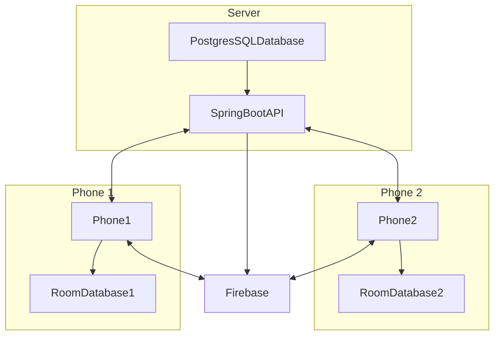

# MessengerApp

This is a trvial Andoird MVVM messenger application that is composed of two main components: the Android app and the [server](https://github.com/lukekweston/MessengerAPI). This app works by registering users with Firebase, sending messages to a [server](https://github.com/lukekweston/MessengerAPI) and then sending the messages back to the correct recepients on their logged in devices as push notifications through Firebase.
If a recipient receives a notification containing data too large for Firebase push notifications, such as an image, a push notification will still be delivered to the app to notify the user. However, the actual data will be retrieved from the server when the user navigates to the desired content within the app.

This app is built using the MVVM design pattern, using a room database for caching data, retrofit for API calls and Dagger hilt for dependency injection as well as live data for ui updates

**Note: that this app is currently under active development and improvements are ongoing**

[Link to the server part of this project](https://github.com/lukekweston/MessengerAPI)

## App Demo

http://www.youtube.com/watch?v=E7sOMdqAuEs
[Click](http://www.youtube.com/watch?v=E7sOMdqAuEs) on the video above to see a demo of the application adding friends and sending messages/images between two devices

## Project structure

Add some explanation

## Setup

Add documents about the environment setup, app, server firebase

## Libraries used

| Dependency | Version | Description |
| --- | --- | --- |
| androidx.core:core-ktx | 1.7.0 | Kotlin extensions for Android core library |
| androidx.appcompat:appcompat | 1.5.1 | Provides backward compatibility for newer Android features on older versions |
| com.google.android.material:material | 1.8.0 | Material Design UI components |
| androidx.constraintlayout:constraintlayout | 2.1.4 | Layout manager for Android |
| junit:junit | 4.13.2 | Unit testing framework for Java |
| androidx.test.ext:junit | 1.1.5 | JUnit extensions for Android testing |
| androidx.test.espresso:espresso-core | 3.5.1 | UI testing framework for Android |
| com.intuit.sdp:sdp-android | 1.1.0 | Library containing scalable size units |
| androidx.lifecycle:lifecycle-livedata-ktx | 2.3.1 | ViewModel and LiveData for data management |
| androidx.lifecycle:lifecycle-viewmodel-ktx | 2.3.1 | ViewModel and LiveData for data management |
| androidx.room:room-ktx | 2.4.3 | Local database |
| androidx.room:room-compiler | 2.4.3 | Kotlin annotation processor for Room |
| com.karumi:dexter | 6.2.2 | Easy permissions handler |
| androidx.navigation:navigation-fragment-ktx | 2.5.2 | For navigation between fragments |
| androidx.navigation:navigation-ui-ktx | 2.5.2 | For navigation between fragments |
| com.squareup.retrofit2:retrofit | 2.9.0 | For querying an API |
| com.squareup.retrofit2:adapter-rxjava3 | 2.9.0 | Retrofit adapter for RxJava3 |
| com.squareup.retrofit2:converter-gson | 2.8.1 | GSON for serializing/deserializing JSON for Retrofit requests |
| io.reactivex.rxjava3:rxandroid | 3.0.0 | Reactive extensions for Android |
| io.reactivex.rxjava3:rxjava | 3.0.0 | Reactive extensions for Java |
| com.squareup.okhttp3:logging-interceptor | 4.7.2 | For logging HTTP responses and configuring Retrofit |
| com.google.firebase:firebase-analytics-ktx | - | Firebase Analytics with Kotlin extensions |
| com.google.firebase:firebase-messaging-ktx | 23.1.2 | Firebase Cloud Messaging with Kotlin extensions |
| com.github.bumptech.glide:glide | 4.15.0 | For displaying images |
| com.github.bumptech.glide:compiler | 4.15.0 | Annotation processor for Glide |
| com.github.chrisbanes:PhotoView | 2.3.0 | Open source library that allows for pinch zooming on images |
| com.google.dagger:hilt-android | 2.45 | Dependency injection library |
| com.google.dagger:hilt-compiler | 2.45 | Kotlin annotation processor for Hilt |

## How the app works

### How a message is sent

--flow chart

### How an image is sent

--flow chart

Add documents about how a message is sent

Add documents on how an image is sent

--- todo change this to mermaid diagram
APP)

1) Take a photo
2) Orientate the photo correctly
3) Save the full image to images/MessengerMvvm
4) Start the Async task
5) Save a message row in the database linking to the saved location, which will trigger messages' live data and make the UI reload
6) Compress the image in the phone - makes it so the API won't be overloaded and run slow
7) Save compressed photos in a hidden folder (all compressed photos will be deleted on logout)
8) Update the message created in 5, will get UI to update
9) API call sending the base64 strings for full image and compressed image

API
1) Gets high and low res photos
2) Saves them in folders and links the path to the database (Improves database performance)
3) Sends push notifications/messages to everyone in the chat that there is a photo ready to be downloaded (the app will only download compressed photo 
unless the user opens a photo, then another call will be made to get the large photo)
4) responds ok, with saved message information

APP
10) Gets the response, and then updates the local message saved in the database

Todo - documentation

1) Document - overall how the app works
2) Libraries used
3) How a message is sent
4) How photos are sent
5) How friends work

## Work in progress

[Link to trello board for current work](https://trello.com/b/gPo8LC0v/messenger-app-todo)
