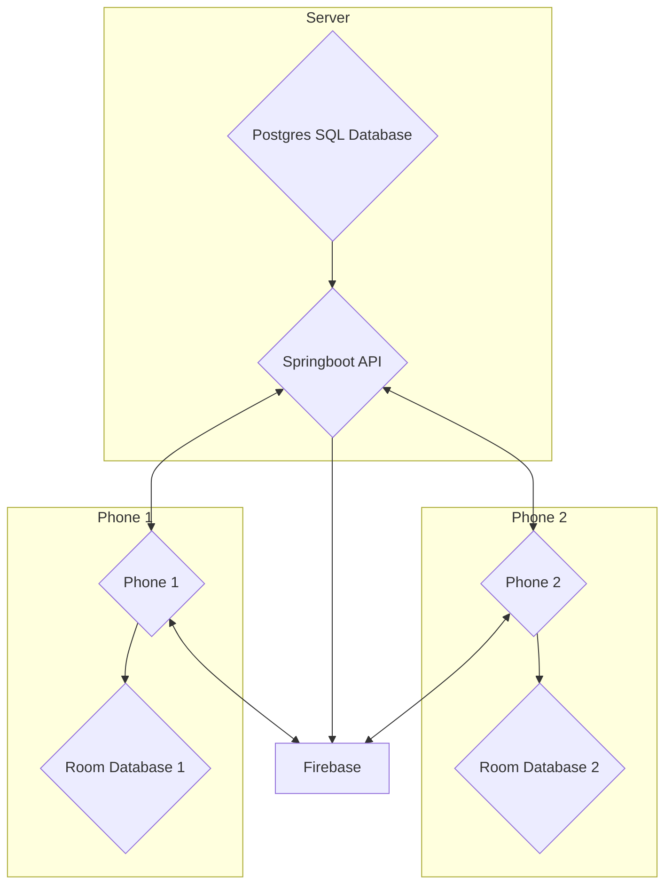

# MessengerApp

This is a trvial Andoird MVVM messenger application that is composed of two main components: the Android app and the [server](https://github.com/lukekweston/MessengerAPI). This app works by registering users with Firebase, sending messages to a [server](https://github.com/lukekweston/MessengerAPI) and then sending the messages back to the correct recepients on their logged in devices as push notifications through Firebase.
If a recipient receives a notification containing data too large for Firebase push notifications, such as an image, a push notification will still be delivered to the app to notify the user. However, the actual data will be retrieved from the server when the user navigates to the desired content within the app.

This app is built using the MVVM design pattern, using a room database for caching data, retrofit for API calls and Dagger hilt for dependency injection as well as live data for ui updates

**Note: that this app is currently under active development and improvements are ongoing**

[Link to the server part of this project](https://github.com/lukekweston/MessengerAPI)


## App Demo

[](http://www.youtube.com/watch?v=E7sOMdqAuEs "Messenger app demonstration")

[Click](http://www.youtube.com/watch?v=E7sOMdqAuEs) on the video above to see a demo of the application adding friends and sending messages/images between two devices

## Project structure

Add some explanation




## Libraries used

| Dependency | Version | Description |
| --- | --- | --- |
| androidx.core:core-ktx | 1.7.0 | Kotlin extensions for Android core library |
| androidx.appcompat:appcompat | 1.5.1 | Provides backward compatibility for newer Android features on older versions |
| com.google.android.material:material | 1.8.0 | Material Design UI components |
| androidx.constraintlayout:constraintlayout | 2.1.4 | Layout manager for Android |
| junit:junit | 4.13.2 | Unit testing framework for Java |
| androidx.test.ext:junit | 1.1.5 | JUnit extensions for Android testing |
| androidx.test.espresso:espresso-core | 3.5.1 | UI testing framework for Android |
| com.intuit.sdp:sdp-android | 1.1.0 | Library containing scalable size units |
| androidx.lifecycle:lifecycle-livedata-ktx | 2.3.1 | ViewModel and LiveData for data management |
| androidx.lifecycle:lifecycle-viewmodel-ktx | 2.3.1 | ViewModel and LiveData for data management |
| androidx.room:room-ktx | 2.4.3 | Local database |
| androidx.room:room-compiler | 2.4.3 | Kotlin annotation processor for Room |
| com.karumi:dexter | 6.2.2 | Easy permissions handler |
| androidx.navigation:navigation-fragment-ktx | 2.5.2 | For navigation between fragments |
| androidx.navigation:navigation-ui-ktx | 2.5.2 | For navigation between fragments |
| com.squareup.retrofit2:retrofit | 2.9.0 | For querying an API |
| com.squareup.retrofit2:adapter-rxjava3 | 2.9.0 | Retrofit adapter for RxJava3 |
| com.squareup.retrofit2:converter-gson | 2.8.1 | GSON for serializing/deserializing JSON for Retrofit requests |
| io.reactivex.rxjava3:rxandroid | 3.0.0 | Reactive extensions for Android |
| io.reactivex.rxjava3:rxjava | 3.0.0 | Reactive extensions for Java |
| com.squareup.okhttp3:logging-interceptor | 4.7.2 | For logging HTTP responses and configuring Retrofit |
| com.google.firebase:firebase-analytics-ktx | - | Firebase Analytics with Kotlin extensions |
| com.google.firebase:firebase-messaging-ktx | 23.1.2 | Firebase Cloud Messaging with Kotlin extensions |
| com.github.bumptech.glide:glide | 4.15.0 | For displaying images |
| com.github.bumptech.glide:compiler | 4.15.0 | Annotation processor for Glide |
| com.github.chrisbanes:PhotoView | 2.3.0 | Open source library that allows for pinch zooming on images |
| com.google.dagger:hilt-android | 2.45 | Dependency injection library |
| com.google.dagger:hilt-compiler | 2.45 | Kotlin annotation processor for Hilt |


## How the app works


[Work in progress](https://trello.com/c/5VldrnoJ/21-add-documenation-for-how-the-app-works)

### Logging in a user 

**Note: This is not a safe way to do this, passing a password as plain text in json request is not good, is just being used for local testing**

1. User enters username and password and presses login
2. Firebase registration token is retrieved from firebase for the device
3. API call is made to  **{{url}}/loginUser**
   
With the example request:
   ```json
{
    "userName": "value",
    "password": "value",
    "firebaseRegistrationToken": "value"
}
```
4. In the server, server checks if the password matches the username
    If the password matches:
        1. firebase token is saved against the user in the server database, success response is sent back
        2. In the app the user will save the user logging in with the firebase token
        3. App will now retrive all the existing conversations/messages (with only low res images)/friendships fot the logged in user and save it to the local room database, any new data will come in as push notifications
        4. App proceeds to conversation/friends screen - User logged in
    If the password does not match
        1. Server responds failure
        2. App displays invalid username or password


## Current work in progress

[Link to trello board for current work](https://trello.com/b/gPo8LC0v/messenger-app-todo)
